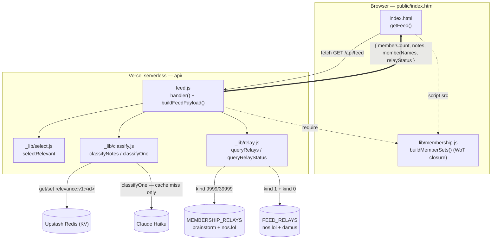

# Story 5: Content-relevance filter for the hashtag source (server-side, AI-assisted)

**Status:** Approved
**Created:** 2026-06-18
**Approved:** 2026-06-19
**Type:** Feature
**Epic:** `community-feed` · **Book:** `community-feed`

## Background

Think of feed curation as two steps:

- **Step A — what's eligible at all?** Which notes are even allowed into the pool.
- **Step B — what order do we show them in?** Ranking the eligible notes.

**Story 2 is Step B** (endorsement + recency scoring). **This story is Step A** — and the two are
independent jobs that compose: this narrows what the hashtag source (Provider 1) contributes; Story 2
ranks whatever ends up in the pool.

**The problem.** A hashtag is a label the *author* chose; it does not guarantee the note's **content**
is on-topic. Previewing the `feat/community-feed` branch surfaced a meaningful number of notes that
carry a qualifying hashtag but whose content has nothing to do with Bitcoin/Nostr/LFO — e.g. a post
about dogs tagged `#grownostr`. The current Provider 1 query matches on the `t` tag only, so these
pass through. We want to refine Provider 1 by **reading the note and judging whether it is actually
about Bitcoin/Nostr/LFO**, dropping the ones that are not — a judgment well-suited to a small AI model
(Claude Haiku).

**Why this forces a backend, and why it goes first.** Today the entire app runs **client-side**:
`server.js` is a 43-line static file server, Vercel serves `public/` statically, and the feed is
built from in-browser relay queries. AI classification cannot run there — the API key would be exposed
in the browser, and we'd re-pay to re-judge the same notes on every page load. Both problems require a
**server we control** that (1) holds the secret and (2) **remembers each note's verdict** (persistence)
so each note is judged once. This is therefore the app's **first real backend** — the `GET /api/feed`
boundary that ADR 0029 already anticipated (`getFeed()` was written as a drop-in for it).

That backend decision is a fork in the road for *all* curation: once the server exists, it becomes the
natural home for sourcing, merging, classification, **and Story 2's ranking**. If Story 2 is built
client-side first and the backend lands afterward, Story 2 gets rebuilt server-side. So this story is
sequenced **before Story 2's implementation**: its ADR settles where curation runs, and Story 2 stays
in Draft until then. (Story 2 is independent of content tags — this ordering is about *where the work
runs*, not a data dependency.)

## User-facing description
As a **signed-in verified member**, I want the feed to show notes that are **actually about**
Bitcoin/Nostr/LFO — not posts that merely carry a relevant hashtag — so that the feed feels relevant
and isn't padded with off-topic content.

## Acceptance criteria
Testable from the outside. AI verdicts are non-deterministic, so criteria target the **pipeline** and a
small **golden fixture set**, not exact per-note model output.

- [ ] Given the feed loads, then its content is served via a **server-side** path (the `GET /api/feed`
  boundary), and the AI classification runs **on the server** — the AI API key is never present in
  client code or network responses.
- [ ] Given a note that carries a qualifying hashtag but whose **content is off-topic** (golden example:
  a dog post tagged `#grownostr`), when the feed is built, then that note is **excluded**.
- [ ] Given a note clearly about — or clearly **adjacent** to — Bitcoin, Nostr, or LFO (e.g. lightning
  / mining / crypto count toward the **bitcoin** score), then it scores ≥ the threshold on that bucket
  and is **included**.
- [ ] Given two on-topic notes of differing sophistication (e.g. "heading to a Bitcoin meetup" vs. a
  technical deep-dive), then relevance does **not** favor the more technical one — both score
  comparably; relevance is **topical, not a depth/quality judgment**.
- [ ] Given a note has already been classified, when the feed is requested again, then it is **not
  re-classified** — the stored verdict is reused (each note judged once; verdict persisted).
- [ ] Given classification runs **synchronously**, when the feed is served, then it contains **only
  notes already classified** — an unjudged note is never shown (it waits for its verdict rather than
  appearing then disappearing).
- [ ] Given the classifier is **unavailable or errors**, when the feed is built, then it **falls back to
  hashtag-only** (no content filtering) and still renders — the feed never breaks on classifier failure.
- [ ] Given the golden fixture set of labelled on-topic / off-topic notes, when run through the pipeline,
  then verdicts match the labels for that set.
- [ ] Given a classified note, then **three per-topic relevance scores** `{ bitcoin, nostr, lfo } ∈
  [0,1]` are **persisted** as a reusable content signal; on-topic for filtering = `max(...) ≥
  threshold`, and the per-topic scores remain available to later curation and v2 topic tabs.

## Concepts touched
Concept Graph API should be consulted by the Architect for live handles.

- **Nostr kind-1 text note** — the unit classified and filtered.
- **Topic hashtag (`t` tag)** — Provider 1's coarse signal; this story adds a *content* signal on top.
- **Content-relevance signal** *(new)* — three persisted per-note scores `{ bitcoin, nostr, lfo } ∈
  [0,1]` from the classifier; initially a Provider-1 filter (`max(...) ≥ threshold`), available to later
  curation and v2 topic tabs.
- **`GET /api/feed` backend boundary** *(new; anticipated by ADR 0029)* — the server-side seam this
  story stands up.
- **Verified LFO member set** — unchanged; still gates Provider 1's authors.

## Out of scope
- **Step B ranking** (endorsement + recency) — that's Story 2.
- **Provider 2 / event-tag sourcing** — unrelated source, still stubbed.
- **Per-topic split** (Bitcoin vs Nostr tabs) — v2; this story produces one relevance verdict, not
  topic tabs.
- **Feed display / card UI changes** — the rendered feed looks the same; only the pool changes.
- **Exact model, prompt, persistence technology, and hosting choices** — Architecture/ADR decisions,
  not fixed here (Claude Haiku is the PO's default; see below).

## Open questions
Product questions resolved 2026-06-19 (see Decided constraints). Remaining — **for the Architect/ADR**:

1. **Persistence** — what store holds the per-note scores, the **cache key** (note id), and whether
   verdicts are ever re-computed (never / on an interval). Architecture decision.

The exact **classification prompt wording** is the Architect/Implementer's to author, guided by the
relevance definition in Decided constraints below.

## Decided constraints (PO direction)
- Classification **must run server-side**; the API key never reaches the client.
- Verdicts are **persisted and reused** — each note classified once, not per feed load.
- The feed **degrades gracefully** to hashtag-only if the classifier is unavailable.
- This story's **ADR gates Story 2 implementation** (where curation runs is decided here).
- **Model: Claude Haiku** (latest) — confirmed (2026-06-19).
- **Output contract** (resolved 2026-06-19): three per-topic relevance scores `{ bitcoin, nostr, lfo }
  ∈ [0,1]`, all persisted. On-topic for filtering = `max(bitcoin, nostr, lfo) ≥ threshold`. No separate
  overall field; the per-topic scores feed later curation and v2 topic tabs.
- **Relevance definition** (resolved 2026-06-19): *moderate* breadth, with **adjacency built into the
  prompt** — clearly-adjacent subjects count toward their bucket (e.g. lightning / mining / crypto →
  **bitcoin**; the broader Nostr ecosystem → **nostr**; LFO community life → **lfo**). Relevance is
  **topical and depth-neutral**: it must **not** favor technical/detailed notes over casual ones (a
  Bitcoin-event post is as relevant as a technical deep-dive).
- **Threshold** (resolved 2026-06-19): start **conservative / lean-inclusive** — a low bar that admits
  borderline notes rather than dropping genuine member content; rationale: small membership (~50) means
  over-filtering would visibly empty the feed. Tunable; tighten as real verdicts are observed.
- **Timing** (resolved 2026-06-19): **synchronous** classification — never show an unjudged note;
  accept a slower first load over a flicker.
- **Cost** (resolved 2026-06-19): **not a concern**; no ceiling set.

## Linked artifacts
- ADR: `engineering-team/decisions/0033-content-relevance-backend.md` (**Accepted** — gates Story 2 implementation)
- Test plan: `engineering-team/stories/community-feed/5-content-relevance-filter.test-plan.md`
- Review: (filled in after Review phase)
- Related: ADR 0029 (community-feed view / `GET /api/feed` boundary); Story 2 `2-curated-selection`
  (Step B ranking); memory `project-feed-curation-direction`.

## Deviations
Small judgment calls during implementation (harvested at book close):

- **Shared module = `buildMemberSets` only, not `getTagItems`.** ADR 0033 said "extract
  `getTagItems`/`buildMemberSets`." `getTagItems` is relay-I/O and differs by environment (browser
  WebSocket vs. Node), so only the pure WoT closure `buildMemberSets(tagItems, seedPubkey)` was extracted
  to `public/lib/membership.js` (UMD, shared by client + server). Each side supplies `tagItems` via its
  own relay path — this still removes the duplication the ADR targeted (one closure, not two).
- **Server relay fetch uses Node's global `WebSocket`, not `nostr-tools` SimplePool.** `api/_lib/relay.js`
  mirrors the browser's `queryRelayStatus` over the global `WebSocket` (Node 18+), keeping the fetch shape
  identical and the relay-status dots working; `nostr-tools` is still used server-side for `nip19` npub
  encoding.
- **`buildFeedPayload` returns `{ memberCount, notes, memberNames }`; the handler spreads in
  `relayStatus`.** Keeps the full ADR 0029 payload (incl. #4 `memberNames` and the relay dots) so the
  render layer is unchanged, while keeping `relayStatus` out of the pure (relay-agnostic) orchestrator.
- **Augment relay swapped primal → damus** (interim, 2026-06-21). Moving the relay fetch server-side
  exposed that `relay.primal.net` silently drops REQ subscriptions from a datacenter IP (opens, 0
  messages, times out; verified by probe, headers don't help). Replaced it with `relay.damus.io` in
  `FEED_RELAYS` (both `api/feed.js` and the `index.html` panel) — server-reachable and carries the
  maintainer's write-blocked test npubs. The durable member-coverage fix is an **epic-level open
  question** (coverage probe of a permissive shortlist vs. NIP-65 outbox model).
- **`CANDIDATE_LIMIT` is env-overridable** (`FEED_CANDIDATE_LIMIT`, default 500). Added so the first
  preview deploy can pull a small pool (e.g. 100) to make KV writes reviewable by hand, without a
  commit-then-revert; Production keeps the ~500 default. Config knob only — no behavior change.
- **Removed 5 obsolete Story-1 `getFeed` data-layer tests** from `tests/community-feed.spec.js` (with the
  user's approval, 2026-06-21). They asserted the *client-side* feed pipeline that ADR 0033 moved to
  `/api/feed`; their coverage now lives in the `node --test` suite + `tests/feed-api.spec.js`. A
  documentation comment was left in place of the block. Two behaviors (the live relay query and the
  picture-sanitization regex) are not re-asserted in `npm test` by design (relay I/O needs the network).

## Architecture (as built)

File tree (runtime app + tests; harness/reference dirs omitted):

```
les-femmes-orange/
├── public/
│   ├── index.html                ← browser app (sign-in, members, feed UI)
│   └── lib/membership.js         ← SHARED UMD buildMemberSets() — used by browser AND server
├── api/
│   ├── feed.js                   ← GET /api/feed: handler() + buildFeedPayload()
│   └── _lib/
│       ├── relay.js              ← queryRelays / queryRelayStatus (Node WebSocket)
│       ├── classify.js           ← classifyNotes (KV-cached) + classifyOne (Haiku)
│       └── select.js             ← selectRelevant (threshold filter + recency slice)
├── server.js                     ← local-dev static server (Vercel uses vercel.json)
├── vercel.json · package.json · playwright.config.js
├── test/                         ← node --test (unit, fakes injected)
│   ├── select-relevant.test.js · classify-notes.test.js · feed-handler.test.js
│   └── fixtures/golden-notes.js  ← labelled notes (seeded scores + eval set)
├── tests/                        ← Playwright e2e
│   ├── community-feed.spec.js · feed-api.spec.js · local-signer.spec.js
└── eval/relevance.eval.js        ← opt-in real-Haiku judgment check (not in npm test)
```

Runtime data-flow (the feed — ADR 0033):



Reading the graph: **`public/lib/membership.js` is the one node shared by browser and server** (the WoT closure), and **`api/feed.js` is the single hub** — every `_lib/*` module, the shared membership module, and all four external services (membership relays, feed relays, KV, Haiku) hang off it. The pure orchestrator `buildFeedPayload` is what the `node --test` suite drives with fakes; the live wiring in `handler()` is validated via preview / `vercel dev` / the opt-in eval.
